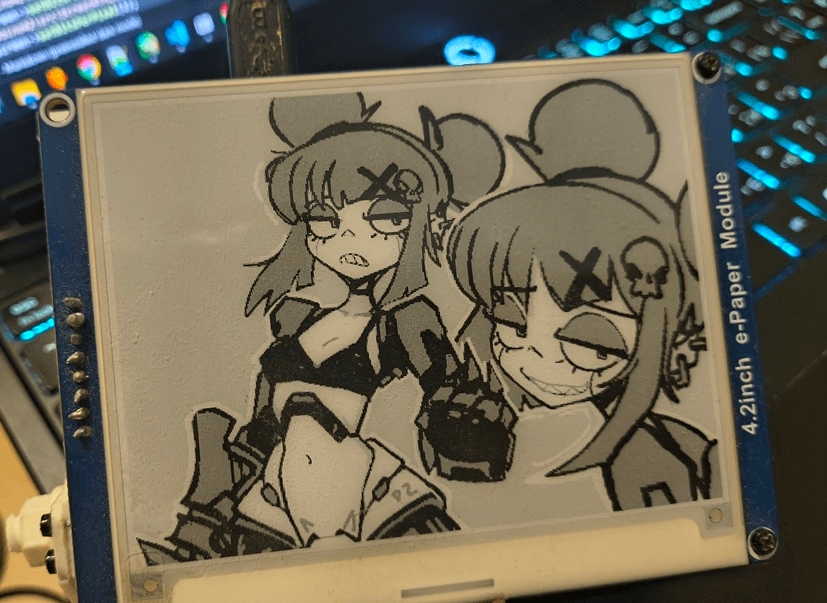
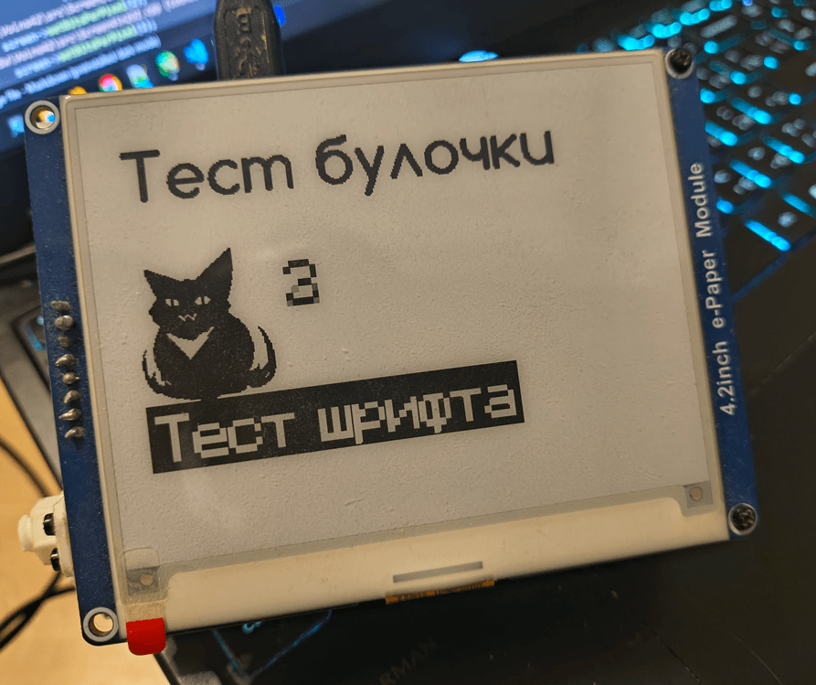

## Kelly EInk - библиотека для взаимодействия с E-ink экранами

Используется в проекте [Volna42](https://volna42.com/)

Типовые схемы подключения можно посмотреть на сайте https://volna42.com/ru/scheme/

lib/ - сами библиотеки

-- **Kelly Eink** - драйверы вывода - реализованы вызовы частичного обновления, работа с чб \ 4-цветным режимом \ режимом совмещения двух буферов вывода (чб + красны \ желтый в отдельном массиве)

-- **Kelly Canvas** - рисовалка-формирование буфера для вывода на дисплей - поддерживается 1-2 битный вывод

src/ - пример работы с комментариями - если тестируете на дисплее без поддержки 2битного режима - уберите вывод начальной картинки \ переключение в 2бит режим (displayInit(2))

_DOCS - официальная документация к контроллерам дисплеев - представлена только для ознакомления и не подподает под лицензию репозитория

Генератор шрифтов + дополнительные инструменты для работы с 1 битной графикой

https://github.com/NC22/Volna42BW-Tools

## Совместимые дисплеи

Вероятно поддерживаются и другие производители (например Good Display), но не было возможности проверить. Возможно, используется идентичный контроллер.

### Протестированные модели

| Модель | Контроллер | Частичное обновление | BUSY после Deep Sleep | Hardware RESET | 4-цветный режим |
|--------|------------|---------------------|----------------------|----------------|-----------------|
| WaveShare 4.2 BW rev 2.1 | UC8176 | Да | LOW | LOW | Нет |
| WaveShare 4.2 BW + Yellow rev 2.1 V2 | UC8176 | Да | LOW | LOW | Нет |
| WaveShare 4.2 BW + Red rev 2.1 | UC8176 | Нет | LOW | LOW | Нет |
| WaveShare 4.2 BW rev 2.2 | SSD1683 | Да | LOW (не соответствует SSD1683) | LOW | Да |
| WeAct 4.2 BW | SSD1683 | Да | HIGH | LOW | Да |
| Heltec 1.5 BW | SSD1683 | Да | Нет режима сна | Нет | Нет |

---

MIT License